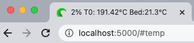
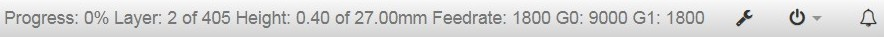
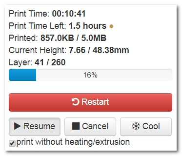
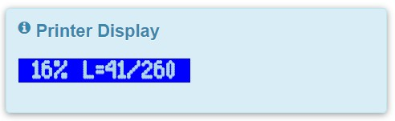
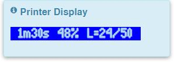

# DisplayLayerProgress

[]()
[]()


A OctoPrint-Plugin that sends the current progress of a print via M117 command to the printer-display and also to the top navigation bar.

#### Support my Efforts

This plugin, as well as my [other plugins](https://github.com/OllisGit/) were developed in my spare time.
If you like it, I would be thankful about a cup of coffee :)

[](https://www.paypal.com/cgi-bin/webscr?cmd=_s-xclick&hosted_button_id=6SW5R6ZUKLB5E&source=url)


It shows:
* ```progress, estimatedEndTime, printTimeLeft,```
* ```currentLayer, totalLayerCount, last/average layerDuration,```
* ```currentHeight, totalHeight, feedrate, fanspeed,```
* ```changeFilamentTimeLeft, estimatedChangeFilamentTime and changefilamentCount```

Some output examples:
- Printer Display: ```50% L=60/120 H=23mm/47mm```
- NavBar: Layer: ```60 / 120 Height: 23mm of 47mm```
- Browser TabTitle: ```12% 19:32 o'clock```

*Output pattern is adjustable!*

**ATTENTION:**
- The layer information works only when the slicer adds "layer-indicator" as comments to the G-Code (CURA-Example as comments like ```;LAYER:10```). Then these indicators are parsed via a regular-expression.
- The G-Code is modified during upload! The "layer-indicators" from the slicer were replaced with a "neutral" M117 G-Code. This is necessary, because during printing OctoPrint removes all comments from g-code.
- Out of the box supported slicers:
  - **CURA, Simplify3D, ideaMaker, KISSlicer, Slic3r**
  - You can add your own layer-expressions in Plugin-Settings
- If you are not able find a layer-expression, try to add a "post processiong script in your slicer" E.g. for "slic3r", see [Enhancement #8](https://github.com/OllisGit/OctoPrint-DisplayLayerProgress/issues/8)
- Sometimes there is a "post processing script" that deletes all comments (e.g. see [Issue #33](https://github.com/OllisGit/OctoPrint-DisplayLayerProgress/issues/33))
- The total height "calculation" can be done in three ways:
    1)the max Z-Value in the G-Code, 2) max Z-Value with extrusion in this height, 3) define a expression like this ```;MAXZ:([0-9]+[.]*[0-9]*).*``` to evaluate the max height [Issue #82](https://github.com/OllisGit/OctoPrint-DisplayLayerProgress/issues/82)
- The height/layer information is sometimes not matching with G-Code Viewer, because the viewer did a lot of "magic" (e.g. add extrusion diameter to height)

**Comment Format Examples:**

CURA: ```;LAYER:10```

Simplify3D: ```; layer 10, Z = 1.640```

The implementation is based on four steps:

1. PreProcessing the selected G-Code during upload (replace layer-comment with M117 indicator G-Code)
2. Read total layer and height count from G-Code before start (used last layer-comment)
3. G-Code-hook to collect the current layer information (M117-command from step 1)
4. Progress-Hook to write all information to the printer/navbar/browserTitle

If you receive a popup message: "Layer indicator not found in file!", then check Layer-Indicator comments in the layer-settings section against your g-code.
If you adjust the layer expression, then you need to reupload your g-code file again.









## Setup

Install via the bundled [Plugin Manager](http://docs.octoprint.org/en/master/bundledplugins/pluginmanager.html)
or manually using this URL:

    https://github.com/OllisGit/OctoPrint-DisplayLayerProgress/releases/latest/download/master.zip


## Configuration

It is possible to change the Output. See Plugin-Settings:


## Versions
see [Release-Overview](https://github.com/OllisGit/OctoPrint-DisplayLayerProgress/releases/)

---
# Developer - Section
## REST - API
You can receive the layer/height and other values via a GET-Call.

    curl -H "X-Api-Key:57FECA453FE94D46851EFC94BC9B5265" http://localhost:5000/plugin/DisplayLayerProgress/values

    {
      "fanSpeed": "69%",
      "feedrate": "3000",
      "feedrateG0": "3000",
      "feedrateG1": "953.8",
      "height": {
        "current": "8.00",
        "currentFormatted": "8"
        "total": "15.00",
        "totalFormatted": "15",
        "totalWithExtrusion": "10.0",  //DEPRECATED don't use it will be removed in version 1.19.0
        "totalWithExtrusionFormatted": "10"  //DEPRECATED don't use it will be removed in version 1.19.0
      },
      "layer": {
        "averageLayerDuration": "0h:01m:03s",
        "averageLayerDurationInSeconds": 63,
        "current": "39",
        "lastLayerDuration": "0h:00m:58s",
        "lastLayerDurationInSeconds": 58,
        "total": "49"
      },
      "print": {
        "progress": "73",
        "timeLeft": "40s",
        "timeLeftInSeconds": 40,
        "estimatedEndTime": "20:24",
        "changeFilamentCount": 3,
        "changeFilamentTimeLeft": "32s",
        "changeFilamentTimeLeftInSeconds": 32,
        "estimatedChangedFilamentTime": "22:36",
      }
    }


## Events
Plugin sends the following custom events to the eventbus like this:

    eventManager().fire(eventKey, eventPayload)

| EventKey                             |
| ------------------------------------ |
| DisplayLayerProgress_progressChanged |
| DisplayLayerProgress_layerChanged    |
| DisplayLayerProgress_heightChanged   |
| DisplayLayerProgress_feedrateChanged |
| DisplayLayerProgress_fanspeedChanged |

**Payload**
```javascript
 {
   'totalLayer':'66',
   'currentLayer':'22',
   'currentHeight':'6.80',
   'currentHeightFormatted':'6',
   'totalHeight':15
   'totalHeightFormatted':'15',
   'totalHeightWithExtrusion':'20.0',  //DEPRECATED don't use it will be removed in version 1.19.0
   'totalHeightWithExtrusionFormatted':'20',  //DEPRECATED don't use it will be removed in next version 1.19.0
   'feedrate':'2700',
   'feedrateG0':'7200',
   'feedrateG1':'2700',
   'fanspeed':'100%',
   'progress':'28',
   'lastLayerDuration':'0h:00m:03s',
   'lastLayerDurationInSeconds':3,
   'averageLayerDuration':'0h:00m:02s',
   'averageLayerDurationInSeconds':2,
   'printTimeLeft':'2m3s',
   'printTimeLeftInSeconds':123,
   'estimatedEndTime':'20:24',
   'estimatedChangedFilamentTime': '20:22',
   'changeFilamentTimeLeft': '1m12s,
   'changeFilamentTimeLeftInSeconds': 72
   'changeFilamentCount': 2
 }
```
Other Plugins could listen to this events like this:

    eventmanager.subscribe("DisplayLayerProgress_layerChanged", self._myEventListener)

or use `octoprint.plugin.EventHandlerPlugin` with something like this:

    def on_event(self, event, payload):
        if event == "DisplayLayerProgress_layerChanged":
            ## do something usefull
